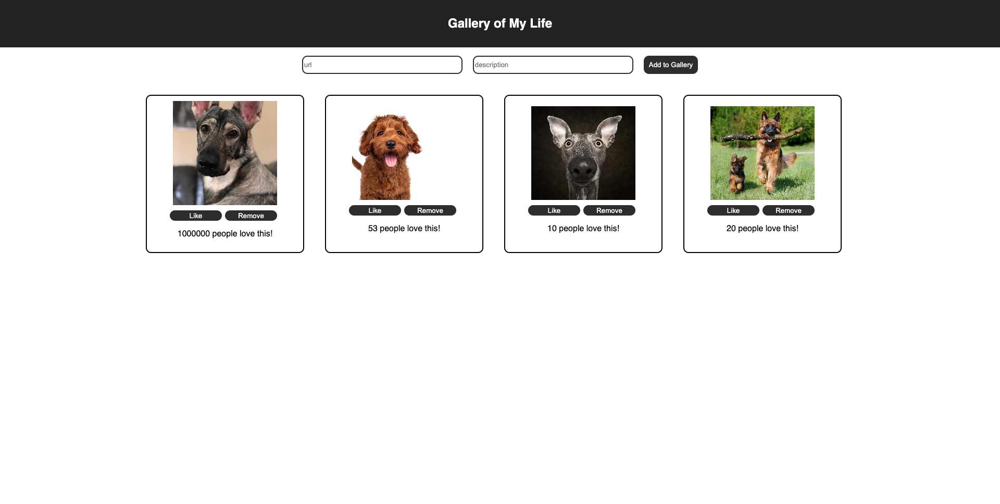

# React Gallery

## Tech Stack
- React
- Node
- Express
- axios
- postgreSQL

## Description
A react crud application that displays any image the user provides with the additional ability to like or delete any image, as well as toggle between the image and image description on click. Simply provide the url to an image and a description of the image to add it to the gallery. The client is built using React, the server is built using Node, and all data state is stored in a postgreSQL database.

## Setup
To set up the app:
- clone repository.
- run 'nmp i' to install all dependencies.
- run 'npm run server' to start the development server.
- run 'npm run client' to start the client.

## Final Product
